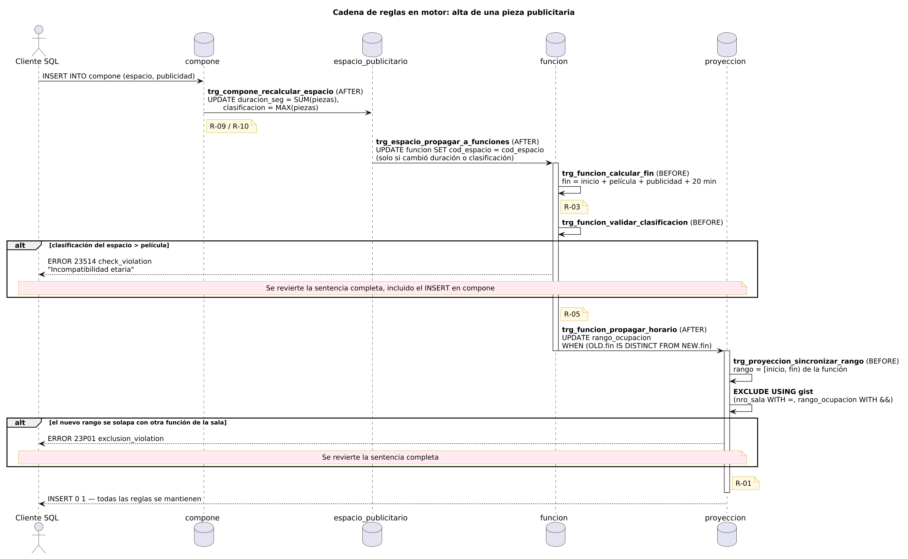

# Reglas de negocio en PostgreSQL

**Automatización e integridad transaccional en PostgreSQL 16: normalización 3FN, restricciones de exclusión GiST y triggers PL/pgSQL.**

Una base de datos para una cadena de cines (programación de funciones, salas físicas, publicidad y venta de entradas) donde **las reglas de negocio críticas las garantiza el motor**, no la aplicación. Ningún cliente puede saltearlas y resisten la concurrencia: dos ventas simultáneas del mismo asiento o dos funciones solapadas en la misma sala se rechazan aunque lleguen al mismo tiempo.

```bash
make up && make test
```

```
▶ 01-casos-positivos
 01-casos-positivos — 36 de 36 pruebas OK
▶ 02-casos-negativos
 02-casos-negativos — 29 de 29 pruebas OK
▶ 03-concurrencia
 03-concurrencia — 9 de 9 pruebas OK

✔ Suites OK: 3 (0.8 s)
```

---

## Qué demuestra

- **Restricciones de exclusión GiST** (`btree_gist` + `tstzrange`): una sala física no puede alojar dos funciones solapadas, y el conflicto se resuelve en el índice, sin locks en la aplicación.
- **Prevención de overbooking** con unicidad sobre una FK compuesta: el asiento pertenece a una proyección en una sala concreta, no solo a la función.
- **Lógica procedural en PL/pgSQL**: horarios calculados, validaciones de tecnología de sala, clasificación etaria y capacidad, con `SECURITY INVOKER` y SQLSTATE estándar.
- **Reglas que se propagan en cascada**: un cambio en una pieza publicitaria revalida, en la misma sentencia, el horario, la clasificación y la ocupación de todas las salas afectadas.
- **Pruebas automatizadas en SQL puro**: 74 aserciones que verifican el SQLSTATE exacto de cada rechazo, más pruebas de **concurrencia real** con dos sesiones simultáneas.

## Modelo


La decisión central es separar la **función** (lo que se programa: película, formato, horario, publicidad) de la **proyección** (la función en una sala física concreta). Una función puede exhibirse en varias salas a la vez. El solapamiento se controla por sala y la venta de entradas, por proyección.

→ Diccionario de datos y cardinalidades: [`docs/modelo-conceptual.md`](docs/modelo-conceptual.md)

## Reglas garantizadas por el motor

| ID | Regla | Mecanismo | Rechazo |
|---|---|---|---|
| R-01 | Una sala no aloja dos funciones solapadas | `EXCLUDE USING gist` | `23P01` |
| R-02 | Un asiento no se vende dos veces por proyección | `UNIQUE` + FK compuesta | `23505` |
| R-03 | El fin de la función se calcula (película + publicidad + limpieza) | trigger `BEFORE` | derivado |
| R-04 | Funciones 3D/IMAX solo en salas equipadas | trigger | `23514` |
| R-05 | La publicidad no supera la clasificación de la película | trigger + propagación | `23514` |
| R-06 | El asiento existe en la sala | trigger + `CHECK` | `23514` |
| R-07 | La sala pertenece a la sucursal de la cartelera | trigger | `23503` |
| R-08 | Un gerente por sucursal | índice único parcial | `23505` |

Son 16 reglas en total. La matriz completa, con cada objeto SQL y cada prueba, está en [`docs/reglas-de-negocio.md`](docs/reglas-de-negocio.md).

## Implementación clave

### Exclusión temporal por sala
```sql
CREATE EXTENSION IF NOT EXISTS btree_gist;

CREATE TABLE proyeccion (
    nro_sala         INTEGER NOT NULL REFERENCES sala(nro_sala),
    id_funcion       INTEGER NOT NULL REFERENCES funcion(id_funcion),
    rango_ocupacion  TSTZRANGE NOT NULL,          -- derivado: [inicio, fin)
    PRIMARY KEY (nro_sala, id_funcion),
    CONSTRAINT proyeccion_sin_solapamiento EXCLUDE USING gist (
        nro_sala WITH =,
        rango_ocupacion WITH &&
    )
);
```
Un trigger de validación con `SELECT ... WHERE rango && NEW.rango` **no alcanzaría**: con `READ COMMITTED` no ve las filas que otra transacción aún no confirmó, así que dos inserciones concurrentes pasarían la validación. La exclusión GiST hace esperar a la segunda transacción y la rechaza cuando la primera confirma ([ADR-02](docs/decisiones-tecnicas.md#adr-02--exclusión-gist-en-lugar-de-trigger-para-el-solapamiento)).

### Horario de fin calculado y no editable
```sql
CREATE TRIGGER trg_funcion_calcular_fin
BEFORE INSERT OR UPDATE ON funcion          -- cualquier UPDATE: el cliente no puede fijar el fin
FOR EACH ROW EXECUTE FUNCTION fn_calcular_fin_funcion();
-- fin = inicio + película + CEIL(publicidad / 60) + 20 min de limpieza
```

### Propagación en cascada


Al agregar un trailer a un bloque publicitario en uso, una sola sentencia recalcula el bloque, recalcula el fin de sus funciones, valida la clasificación etaria y revalida la ocupación de cada sala. Si algún paso falla, se revierte todo ([ADR-08](docs/decisiones-tecnicas.md#adr-08--propagación-en-cascada-reutilizando-validaciones)).

### Concurrencia real en las pruebas
```sql
-- Sesión A: vende el asiento 100 y no confirma
SELECT dblink_exec('sesion_a', 'BEGIN');
SELECT dblink_exec('sesion_a', $$INSERT INTO entrada (...) VALUES (1, 1, 100, ...)$$);

-- Sesión B: intenta el mismo asiento → queda bloqueada
SELECT dblink_send_query('sesion_b', $$INSERT INTO entrada (...) VALUES (1, 1, 100, ...)$$);
SELECT pg_temp.assert_true('B queda bloqueada', pg_temp.esperar_bloqueo(:pid_b));

-- A confirma → B recibe unique_violation
SELECT dblink_exec('sesion_a', 'COMMIT');
SELECT pg_temp.assert_igual('B rechazada', pg_temp.sqlstate_remoto('sesion_b'), '23505');
```

## Lo que encontraron las pruebas

La batería detectó **cuatro defectos** en la primera versión del esquema. En todos, el motor **aceptaba en silencio** datos que violaban reglas. El más grave: al cambiar la película de una función, el fin se recalculaba pero el rango de la sala no, y el GiST dejaba pasar un solapamiento real. La causa era que `UPDATE OF columna` no se dispara cuando la columna la modifica un trigger `BEFORE`.

Cada defecto está documentado con su reproducción, la causa raíz, la corrección y una prueba de mutación que confirma que los tests lo detectan: [`docs/bugs-encontrados.md`](docs/bugs-encontrados.md).

## Uso

Requisitos: Docker (con Compose) y `make`. No hace falta PostgreSQL ni `psql` en el host.

| Comando | Acción |
|---|---|
| `make up` | Levanta PostgreSQL 16 y espera a que el seed esté cargado |
| `make test` | Recarga la base y ejecuta la batería (`SUITES="02 03"` para elegir, `NO_COLOR=1` sin colores) |
| `make reset` | Elimina y recarga schema, funciones, triggers, seed y vistas |
| `make psql` | Abre una sesión interactiva |
| `make down` | Detiene el contenedor (conserva los datos) |
| `make clean` | Detiene el contenedor y elimina el volumen |

La base queda expuesta en `127.0.0.1:5433` (base `sunstar`, usuario y contraseña `postgres`). Credenciales y puerto se pueden cambiar con un `.env` (`POSTGRES_DB`, `POSTGRES_USER`, `POSTGRES_PASSWORD`, `POSTGRES_PORT`).

Algunas consultas para empezar:
```sql
SELECT sucursal, nro_sala, pelicula, inicio, fin, ocupacion_pct FROM v_programacion ORDER BY nro_sala, inicio;

-- Intentar romper una regla
INSERT INTO proyeccion (nro_sala, id_funcion) VALUES (1, 2);
-- ERROR:  Incompatibilidad de sala: La función 2 requiere tecnología 3D, pero la sala 1 es 2D
```

## Estructura

```
├── sql/
│   ├── 01-schema.sql          # Extensiones, tipos, dominios, tablas, restricciones GiST
│   ├── 02-functions.sql       # Funciones PL/pgSQL
│   ├── 03-triggers.sql        # Triggers
│   ├── 04-seed.sql            # Datos de ejemplo coherentes
│   ├── 05-views.sql           # Vistas operativas
│   └── 99-drop.sql            # Limpieza en orden inverso
├── tests/
│   ├── 00-helpers.sql         # Framework de aserciones en pg_temp
│   ├── 01-casos-positivos.sql # 36 aserciones
│   ├── 02-casos-negativos.sql # 29 aserciones con SQLSTATE exacto
│   └── 03-concurrencia.sql    # 9 aserciones con dos sesiones vía dblink
├── scripts/                   # init-db.sh, reset-db.sh, run-tests.sh (corren en el contenedor)
├── diagramas/                 # DER y flujo de reglas (PlantUML + PNG)
├── docs/
│   ├── modelo-conceptual.md   # Entidades, cardinalidades, diccionario
│   ├── reglas-de-negocio.md   # Matriz regla → objeto SQL → SQLSTATE → prueba
│   ├── decisiones-tecnicas.md # ADRs
│   ├── bugs-encontrados.md    # Defectos detectados por las pruebas
│   └── migracion-del-modelo.md# Refactorización desde el modelo original
├── docker-compose.yml
└── Makefile
```

## Licencia

[MIT](LICENSE)
