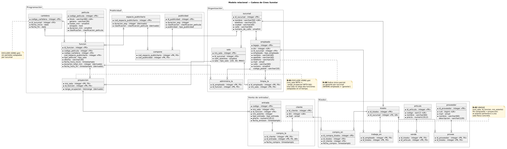

# Modelo conceptual y diccionario de datos

Universo del discurso: una cadena de cines con varias sucursales. Cada sucursal tiene salas físicas con distinta tecnología, programa funciones en una cartelera semanal, proyecta publicidad antes de cada función, vende entradas por asiento y opera un kiosko de snacks.

Fuente: [`diagramas/der.puml`](../diagramas/der.puml).

## Concepto central: función vs. proyección

La decisión de modelado más importante es separar dos conceptos que el modelo original mezclaba:

| Concepto | Tabla | Qué representa |
|---|---|---|
| **Función** | `funcion` | Lo que se programa: película + formato + idioma + horario + bloque publicitario. Es un evento lógico. |
| **Proyección** | `proyeccion` | Dónde ocurre: la asignación de una función a una sala física concreta, con su rango de ocupación. |

Una función puede proyectarse en varias salas a la vez (función multi-sala, por ejemplo un estreno). Por eso:

- El solapamiento temporal se controla en `proyeccion`, que es donde se ocupa una sala (R-01).
- La entrada se vende para una proyección, no para una función: el asiento 1 de la Sala 1 y el asiento 1 de la Sala 4 son asientos distintos de la misma función (R-02).

## Cardinalidades

| Relación | Cardinalidad | Implementación |
|---|---|---|
| Sucursal – Sala | 1 : N | `sala.id_sucursal` |
| Sucursal – Empleado | 1 : N | `empleado.id_sucursal` |
| Sucursal – Gerente | 1 : 0..1 | índice único parcial `WHERE empleado = 'gerente'` |
| Sucursal – Kiosko | 1 : 0..1 | `kiosko.id_sucursal UNIQUE` |
| Sucursal – Cartelera | 1 : N, vigencias disjuntas | `cartelera.id_sucursal` + `EXCLUDE` sobre `daterange` |
| Cartelera – Función | 1 : N | `funcion.codigo_cartelera` |
| Película – Función | 1 : N | `funcion.codigo_pelicula` |
| Espacio publicitario – Función | 0..1 : N | `funcion.cod_espacio_publicitario` (nullable) |
| Función – Sala | N : M, sin solapamiento por sala | `proyeccion` + `EXCLUDE` sobre `tstzrange` |
| Proyección – Entrada | 1 : N, un asiento por proyección | FK compuesta + `UNIQUE (nro_sala, id_funcion, nro_asiento)` |
| Espacio publicitario – Publicidad | N : M | `compone` |
| Cliente – Entrada | 1 : N, cada entrada tiene a lo sumo un comprador | `compra_la` con `UNIQUE (id_entrada)` |
| Kiosko – Artículo | N : M | `vende` |
| Kiosko – Proveedor | N : M | `provee` |
| Empleado – Kiosko | N : M | `trabaja_en` |
| Empleado – Sala (limpieza) | N : M | `limpia_la` |
| Empleado – Función (administración) | N : M | `administra_la` |
| Cliente – Kiosko (compras) | N : M con historial | `compra_en` (PK propia, admite compras repetidas) |

## Tipos enumerados

| Tipo | Valores | Uso |
|---|---|---|
| `tipo_empleado` | `gerente`, `limpieza`, `atencion_al_cliente` | Rol del empleado |
| `tipo_sala` | `2D`, `3D`, `IMAX` | Tecnología de la sala y formato de la función |
| `clasificacion_pelicula` | `ATP`, `P-13`, `P-16`, `P-18`, `P-21` | Películas, publicidades y espacios publicitarios |
| `tipo_publicidad` | `trailer`, `publicidad_negocio`, `promocion_sucursal` | Tipo de pieza publicitaria |
| `tipo_entrada` | `kiosko`, `online` | Canal de venta de la entrada |

Las clasificaciones no se comparan por el orden del `ENUM`, sino con `fn_peso_clasificacion()` (ATP = 1 … P-21 = 5). Así la regla no depende del orden en que se declararon los valores.

## Dominios

| Dominio | Base | Validación |
|---|---|---|
| `email` | `varchar(255)` | Expresión regular `^[A-Za-z0-9._%+-]+@[A-Za-z0-9.-]+\.[A-Za-z]{2,}$` |
| `ean13` | `bigint` | `0 … 9 999 999 999 999` (hasta 13 dígitos) |

## Diccionario de datos

Convenciones: las claves primarias simples son `INTEGER GENERATED ALWAYS AS IDENTITY`. Los importes usan `numeric(10,2)` y los instantes, `timestamptz`. Los atributos marcados como **derivados** los calcula el motor y no se pueden editar (R-14).

### Organización

**`sucursal`** — Sede física del complejo.
| Columna | Tipo | Restricciones |
|---|---|---|
| `id_sucursal` | integer | PK |
| `nombre` | varchar(50) | NOT NULL, UNIQUE, no vacío |
| `telefono` | varchar(25) | |
| `ciudad` | varchar(40) | NOT NULL |
| `calle` | varchar(60) | NOT NULL |
| `numero_de_calle` | smallint | NOT NULL, > 0 |

**`sala`** — Sala de exhibición con tecnología y aforo fijos.
| Columna | Tipo | Restricciones |
|---|---|---|
| `nro_sala` | integer | PK |
| `id_sucursal` | integer | FK → `sucursal` (CASCADE) |
| `cant_asientos` | smallint | NOT NULL, > 0 |
| `sala` | tipo_sala | NOT NULL |

**`empleado`** — Personal de cada sucursal.
| Columna | Tipo | Restricciones |
|---|---|---|
| `legajo` | integer | PK |
| `dni` | integer | NOT NULL, UNIQUE, > 0 |
| `id_sucursal` | integer | FK → `sucursal` (RESTRICT) |
| `empleado` | tipo_empleado | NOT NULL; un solo `gerente` por sucursal |
| `nombre`, `apellido` | varchar(40) | NOT NULL |
| `telefono` | varchar(25) | NOT NULL |
| `mail` | email | NOT NULL |
| `calle` | varchar(60) | NOT NULL |
| `numero` | smallint | NOT NULL, > 0 |
| `codigo_postal` | varchar(10) | |

**`limpia_la`** (empleado ↔ sala) y **`administra_la`** (empleado ↔ función): relaciones N:M con PK compuesta.

### Programación

**`cartelera`** — Período de programación de una sucursal.
| Columna | Tipo | Restricciones |
|---|---|---|
| `codigo_cartelera` | integer | PK |
| `id_sucursal` | integer | FK → `sucursal` (CASCADE) |
| `fecha_inicio`, `fecha_fin` | date | NOT NULL, `fecha_fin >= fecha_inicio`; sin vigencias solapadas por sucursal |

**`pelicula`** — Título exhibible.
| Columna | Tipo | Restricciones |
|---|---|---|
| `codigo_pelicula` | integer | PK |
| `titulo` | varchar(80) | NOT NULL, UNIQUE, no vacío |
| `genero` | varchar(30) | |
| `trailer_min` | smallint | NOT NULL, > 0, default 2 |
| `sinopsis` | text | no vacía si se informa |
| `duracion_min` | smallint | NOT NULL, > 0 |
| `clasificacion` | clasificacion_pelicula | NOT NULL |

**`funcion`** — Evento programado.
| Columna | Tipo | Restricciones |
|---|---|---|
| `id_funcion` | integer | PK |
| `codigo_pelicula` | integer | FK → `pelicula` (RESTRICT) |
| `codigo_cartelera` | integer | FK → `cartelera` (CASCADE) |
| `cod_espacio_publicitario` | integer | FK → `espacio_publicitario` (SET NULL), opcional |
| `tipo_pelicula` | tipo_sala | NOT NULL: formato de la función |
| `idioma` | varchar(30) | NOT NULL, no vacío |
| `fecha_hora_inicio` | timestamptz | NOT NULL |
| `duracion_total_min` | integer | **derivado** (R-03) |
| `fecha_hora_fin` | timestamptz | **derivado** (R-03), `> fecha_hora_inicio` |

**`proyeccion`** — Asignación de una función a una sala física.
| Columna | Tipo | Restricciones |
|---|---|---|
| `nro_sala` | integer | PK, FK → `sala` (RESTRICT) |
| `id_funcion` | integer | PK, FK → `funcion` (CASCADE) |
| `rango_ocupacion` | tstzrange | **derivado** `[inicio, fin)`; `EXCLUDE` por sala (R-01) |

### Publicidad

**`publicidad`** — Pieza individual: trailer, anuncio comercial o promoción.
| Columna | Tipo | Restricciones |
|---|---|---|
| `id_publicidad` | integer | PK |
| `duracion_seg` | integer | NOT NULL, > 0 |
| `clasificacion` | clasificacion_pelicula | NOT NULL |
| `publicidad` | tipo_publicidad | NOT NULL |

**`espacio_publicitario`** — Bloque que se proyecta antes de la película.
| Columna | Tipo | Restricciones |
|---|---|---|
| `cod_espacio_publicitario` | integer | PK |
| `duracion_seg` | integer | **derivado**: suma de piezas (R-09) |
| `clasificacion` | clasificacion_pelicula | **derivado**: la más restrictiva (R-10) |

**`compone`** — Piezas de cada espacio (N:M, PK compuesta, CASCADE en ambos lados).

### Venta de entradas

**`entrada`** — Ticket para un asiento de una proyección.
| Columna | Tipo | Restricciones |
|---|---|---|
| `codigo` | integer | PK |
| `nro_sala`, `id_funcion` | integer | FK compuesta → `proyeccion` (RESTRICT) |
| `nro_asiento` | integer | NOT NULL, 1 … capacidad de la sala (R-06); único por proyección (R-02) |
| `tipo_entrada` | tipo_entrada | NOT NULL |
| `precio` | numeric(10,2) | NOT NULL, >= 0 |
| `fecha_emision` | timestamptz | NOT NULL, default `CURRENT_TIMESTAMP` |

**`cliente`** — Comprador registrado (`dni` UNIQUE, `mail` con dominio `email`).

**`compra_la`** — Cliente que compró cada entrada (`id_entrada` UNIQUE: una entrada tiene un solo comprador).

### Kiosko

| Tabla | Contenido | Restricciones destacadas |
|---|---|---|
| `kiosko` | Punto de venta de la sucursal | `id_sucursal` UNIQUE (R-11) |
| `articulo` | Producto a la venta | `codigo` dominio `ean13` UNIQUE, `precio` > 0 |
| `proveedor` | Empresa abastecedora | `cuit` UNIQUE |
| `vende` | Artículos de cada kiosko | N:M |
| `provee` | Proveedores de cada kiosko | N:M |
| `trabaja_en` | Personal asignado a cada kiosko | N:M |
| `compra_en` | Compras de clientes en kioskos | PK propia; admite varias compras del mismo cliente |

## Zona horaria

Todos los instantes se guardan como `timestamptz`, que internamente es UTC. `01-schema.sql` fija la zona horaria de la base en `America/Argentina/Buenos_Aires`, así que un literal sin offset (`'2026-10-15 14:00'`) se interpreta como hora local y los resultados se muestran con `-03` (P-01).
